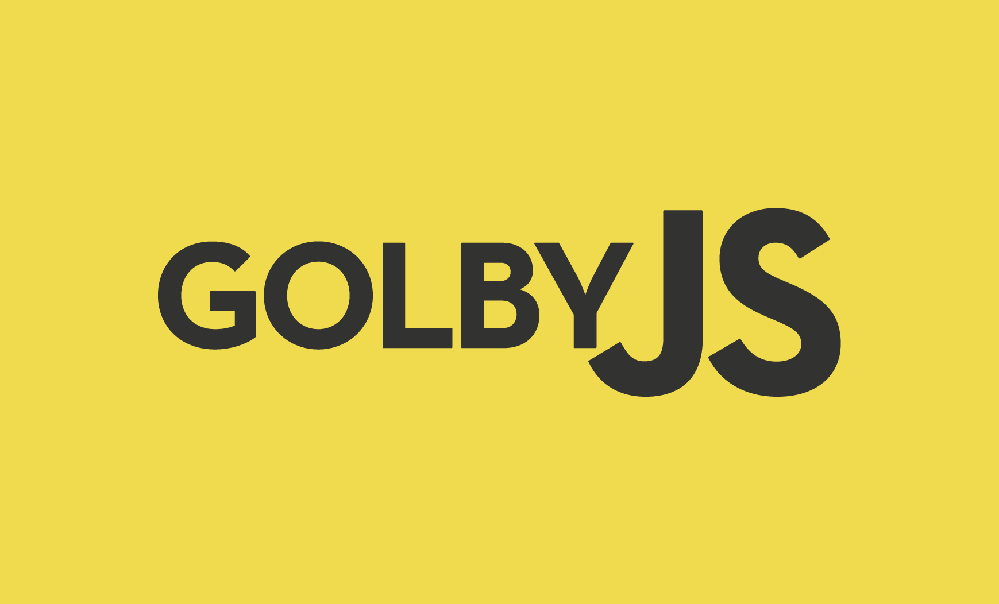

<p align="center">
  
</p>


# 🌐 GOLBYJS

<p align="center">
  <a href="#-sobre">Sobre</a>&nbsp;&nbsp;&nbsp;|&nbsp;&nbsp;&nbsp;
  <a href="#-idealizadores">Idealizadores</a>&nbsp;&nbsp;&nbsp;|&nbsp;&nbsp;&nbsp;
  <a href="#-inspirações">Inspirações</a>&nbsp;&nbsp;&nbsp;|&nbsp;&nbsp;&nbsp;
	<a href="#-exercícios">Exercícios</a>&nbsp;&nbsp;&nbsp;|&nbsp;&nbsp;&nbsp;
	<a href="#-iniciando">Iniciando</a>&nbsp;&nbsp;&nbsp;|&nbsp;&nbsp;&nbsp;
	<a href="#-base-de-conteúdos">Base de conteúdos</a>&nbsp;&nbsp;&nbsp;|&nbsp;&nbsp;&nbsp;
  <a href="#-licença">Licença</a>
</p>

---

## 📌 Sobre
**Um curso de iniciantes para iniciantes!**

<br>
    Abordagem completa de conteúdos essenciais para emergir sua experiência na linguagem que vem crescendo cada vez mais no mundo!
<br>

### 🙇 Idealizadores
A ideia veio de [@Golden](https://github.com/jsGolden) e [@BernadoRZ](https://github.com/bernardorz).
Acreditamos que ao transcrever o que aprendemos pela internet entre vídeo aulas e cursos, é mais uma chance de aprimorar esses conhecimentos e fortificar nossa base em lógica de programação.

### ✨ Inspirações
Temos como alicerce de conteúdos pesquisados de acordo com os vídeos de [@Rodrigo Manguinho](https://github.com/rmanguinho) e base de exercícios retirados do repositório de [@Fernando Daciuk](https://github.com/fdaciuk).

### 📚 Exercícios
Você pode acessar nossa base de exercícios contendo toda explicação por trás das resoluções [clicando aqui!](./exercicios)

### 🚀 Iniciando
Para abrir com o editor de código preferido, execute os seguintes comandos:

```shell
    git clone https://github.com/bernardorz/golbyJs.git
    cd golbyJs
    # Abra o diretório no seu editor de texto / IDE
```

### 🤓 Base de conteúdos

```shell
    # Pré-requisitos
    * Lógica de programação
    * Cliente e servidor
    * Entender o que significa ser case-sensitive

    # Importante saber
    * HTML
    * CSS
    * Unicode

    # Como rodar um código JS?
    * Console
    * Script tag
    * Link externo

    # Comentários
    * Linha
    * Bloco

    # Variáveis
    * var, let, const
    * escopo
    * hoisting

    # Tipos
    * null
    * Object
    * Function
    * undefined
    * Boolean
    * Number
    * String

    # Conversão de Tipos
    * Explícita
    * Implícita

    # Literais
    * Array
    * Object
    * Boolean
    * Number
    * String

    # Estruturas de Repetição
    * while
    * do while
    * for
    * for in
    * for of
    * break
    * continue

    # Declaração Condicional
    * if else
    * switch
    * falsy
    * == vs ===

    # Tratamento de Erros
    * try catch finally
    * throw
    * Error

    # Operadores
    * Atribuição
    * Comparação
    * Aritméticos
    * Lógicos
    * Condicional
    * Vírgula
    * Relacionais
    * String
    * Unários
    * Agrupamento
    * Precedência de operadores
    * Tabela verdade

    # Functions
    * Declaração
    * Funções anônimas
    * Chamar
    * Parâmetros
    * args
    * Escopo
    * Closure
    * Currying
    * Higher Order Functions
    * Arrow Functions
    * Spread Operator

    # Classes
    * this
    * Prototype
    * Desestruturação de objetos
    * JSON
    * new
    * super
    * constructor
    * static
    * extends
    * get/set

    # Classes Importantes
    * Array
    * Date
    * String
    * Intl
    * RegExp

    # Programação Assíncrona
    * setTimeout
    * setInterval
    * callback
    * promise
    * async await
    * Event Loop

    # Módulos
    * CJS
    * ESM
    * import
    * export
    * default export
    * named export
```

## 📝 Licença
Esse projeto está sob a licença [MIT](LICENSE).

---